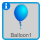

---
title: Balloons
level: Scratch 1
language: en-GB
stylesheet: scratch
embeds: "*.png"
materials: ["Club Leader Resources/*.*"]
...

# Einführung { .intro }

Wir wollen ein Ballon zerschmettern Spiel machen!

<div class="scratch-preview">
	<iframe allowtransparency="true" width="485" height="402" src="http://scratch.mit.edu/projects/embed/26745384/?autostart=true" frameborder="0"></iframe>
	
</div>

# Schritt 1: Ballon animieren { .activity }

## Checkliste für das Spiel { .check }

+ Starte ein neues Scratch Projekt, und lösche die Katzenfigur, so das das Projekt leer ist. Du kannst den online Scratch Editor hier finden: <a href="http://jumpto.cc/scratch-new">jumpto.cc/scratch-new</a>.

+ Füge eine neune Ballon Figur hinzu und einen passenden Hintergrund für die Bühne.

	

+ Füge diesen Code für deinen Ballon hinzu, so dass er auf dem Bildschirm herumfliegt:

	```blocks
		when flag clicked
		go to x:(0) y:(0)
		point in direction (45 v)
		forever
			move (1) steps
			if on edge, bounce
		end
	```

+ Teste deinen Ballon. Bewegt er sich zu langsam? Ändere die Nummern in deinem Code, wenn du möchtest, dass er schneller wird.

+ Hast du ebenfalls bemerkt, dass dein Ballon sich umdreht wenn er den Bühnenrand berührt? 

	

	Ballons bewegen sich nicht so! Um das zu ändern, klick auf die Ballonfigur und klicke dann das blaue `i` {.blockmotion}.

	
	
	In dem 'Drehmodus' Bereich, klicke auf den Punkt um die Drehung des Ballons zu stoppen.

	

+ Teste dein Programm erneut um zu sehen, ob das Problem behoben ist.


## Speichere dein Projekt { .save }

# Schritt 2: Zufällige Ballons { .activity }

##Checkliste für das Spiel { .check }
+ Mit dem Code, den du jetzt hast, wird dein Ballon immer am selben Platz starten und sich in die selbe Richtung bewegen. Klicke einige Male auf die Flagge um dein Programm zu starten und du wirst sehen, dass es immer das gleiche ist.

+ Anstatt jedes Mal die gleiche Position x und y zu benutzen, kannst du deine Figur eine zufällige Zahl wählen lassen. Ändere den Code deines Ballons, so dass es so aussieht:

	```blocks
		when flag clicked
		go to x:(pick random (-150) to (150)) y:(pick random (-150) to (150))
		point in direction (45 v)
		forever
			move (1) steps
			if on edge, bounce
		end
	```

+ Wenn du die grüne Flagge einige Male anklickst, wird dir auffallen, dass dein Ballon jedes Mal von einem anderen Platz aus startet.

+ Du kannst sogar eine zufällige Nummer benutzen um jedes Mal eine zufällige Ballonfarbe zu bekommen:

	```blocks
		change [colour v] effect by (pick random (0) to (200))
	```

	

	Was passiert wenn dieser Code am Anfang deines Programms eingesetzt wird? Ändert sich etwas, wenn du diesen Code in die `wiederhole fortlaufend` {.blockcontrol} Schleife setzt?
	
## Speichere dein Projekt { .save }

## Herausforderung: Mehr Zufälligkeit {.challenge}
Kannst du deinen Ballon starten indem du ihn in eine zufällige Richtung richtest (zwischen -90 und 180 Grad)?

## Speichere dein Projekt { .save }

# Schritt 3: Knalle deinen Ballon { .activity }

Erlauben wir dem Spieler den Ballon platzen zu lassen!

## Checkliste für das Spiel { .check }

+ Klicke auf deine Ballonfigur, und dann klicke auf die "Kostüme" Sparte. Du kannst alle andern Kostüme löschen, lass nur ein Ballonkostüm übrig. Füge ein neues Kostüm hinzu, indem du auf 'Male ein neues Kostüm' und gestalte ein neues Kostüm mit dem Namen 'Knallen'.

	

+ Versichere dich, dass dein Ballon zum richtigen Kostüm wechselt, wenn das Spiel beginnt. Dein Code sollte nun so aussehen:

	```blocks
		when flag clicked
		switch costume to [balloon1-a v]
		point in direction (pick random (-90) to (180))
		go to x:(pick random (-150) to (150)) y:(pick random (-150) to (150))
		change [color v] effect by (pick random (0) to (200))
		forever
			move (1) steps
			if on edge, bounce
		end
	```

+ Um dem Spieler zu erlauben, dass er den Ballon knallen lassen darf, füge diesen Code hinzu:

	```blocks
		when this sprite clicked
		switch costume to [burst v]
		play sound [pop v]
	```

+ Teste dein Projekt. Kannst du den Ballon abknallen? Funktioniert es wie erwartet? Du musst diesen Code verbessern, so dass, wenn der Ballon angeklickt wird, das 'knallen' Kostüm für eine kurze Zeit angezeigt wird, danach ist es wieder verschwunden. Du kannst all das machen indem du deinen Ballon Code `when sprite clicked` {.blockevents} folgender Maßen änderst:  

	```blocks
		when this sprite clicked
		switch costume to [burst v]
		play sound [pop v]
		wait (0.3) secs
		hide
	```

+ Nun, wenn du den Ballon löschst, wenn er angeklickt ist, musst du ebenfalls einen `show` {.blocklooks} Block am Anfang von `when flag clicked` {.blockevents} hinzufügen.

+ Try popping a balloon again, to check that it works properly. If you find it difficult to pop the balloon without dragging it around, you can play the game in fullscreen mode by clicking this button:

	

## Save your project { .save }

# Step 4: Adding a score { .activity .new-page }

Let's make things more interesting by keeping score.

## Activity Checklist { .check }

+ To keep the player's score, you need a place to put it. A _variable_ is a place to store data that can change, like a score.

	To create a new variable, click on the 'Scripts' tab, select `Data` {.blockdata} and then click 'Make a Variable'.

	

	Type 'score' as the name of the variable, make sure that it is available for all sprites, and click 'OK' to create it. You'll then see lots of code blocks that can be used with your `score` {.blockdata} variable.

	

	You'll also see the score in the top-left of the stage.

	

+ When a new game is started (by clicking the flag), you want to set the player's score to 0. Add this code to the top of the balloon's `when flag clicked` {.blockevents} code:

	```blocks
	set [score v] to [0]
	```

+ Whenever a balloon is popped, you need to add 1 to the score:

	```blocks
		when this sprite clicked
		switch costume to [burst v]
		play sound [pop v]
		wait (0.3) secs
		change [score v] by (1)
		hide
	```

+ Run your program again and click the balloon. Does your score change?

## Save your project { .save }

# Step 5: Lots of balloons { .activity }

Popping 1 balloon isn't much of a game, so let's add lots more!

One simple way to get lots of balloons is just to right-click on the balloon sprite and click 'duplicate'. This is OK if you only want a few, but what if you need 20? or 100? Are you really going to click 'duplicate' that many times?

## Activity Checklist { .check }

+ A much better way of getting lots of balloons is to _clone_ the balloon sprite.

	Drag your balloon `when flag clicked` {.blockevents} code (except the `score` {.blockdata} block) off of the event (don't delete it), and instead add code to create 20 balloon clones.

	You can now attach the code you've just removed to the `when I start as a clone` {.blockevents} event. You should also replace the `hide` {.blocklooks} block in the balloon-clicking script with a `delete this clone` {.blockcontrol} block.

	Your balloon code should now look like this:

	

+ Test your project! Now when the flag is clicked, your main balloon sprite will hide and then clone itself 20 times. When each of these 20 clones is started, they will each bounce around the screen randomly, just as they did before. See if you can pop the 20 balloons!

## Save your project { .save }

# Step 6: Adding a timer { .activity }

You can make your game more interesting, by only giving your player 10 seconds to pop as many balloons as possible.

## Activity Checklist { .check }

+ You can use another variable to store the remaining time left. Click on the stage, and create a new variable called 'time':

	

+ This is how the timer should work:

	+ The timer should start at 10 seconds;
	+ The timer should count down every second;
	+ The game should stop when the timer gets to 0.

	Here's the code to do this, which you can add to your _stage_:

	```blocks
		when flag clicked
		set [time v] to [10]
		repeat until <(time) = [0]>
			wait (1) secs
			change [time v] by (-1)
		end
		stop [all v]
	```

	To add the `repeat until`{.blockcontrol}`time`{.blockdata}`= 0`{.blockoperators} code, first you'll need to drag a green `=` {.blockoperators} block, onto your `repeat until` {.blockcontrol} block:

	

	You can then drag your `time` {.blockdata} variable onto the `=` {.blockoperators} block:

	

+ Drag your 'time' variable display to the right side of the stage. You can also right-click on the variable display and choose 'large readout' to change how the time is displayed.

	

+ Test your game. How many points can you score? If your game is too easy, you can:

	+ Give the player less time;
	+ Have more balloons;
	+ Make the balloons move faster;
	+ Make the balloons smaller.

	Test your game a few times until you're happy that it's the right level of difficulty.

## Save your project { .save }

## Challenge: More objects {.challenge}
Can you add in other objects to your game? You can add good objects, like donuts, that give you lots of points, or bad objects, like bats, that take points away.


You'll need to think about the objects you're adding. Think about:

+ How many will there be?
+ How big is it? How does it move?
+ How many points will you score (or lose) for clicking it?
+ Will it move faster or slower than the balloons?
+ What will it look/sound like when it's been clicked?

If you need help adding another object, you can reuse the steps above!

## Save your project { .save }
